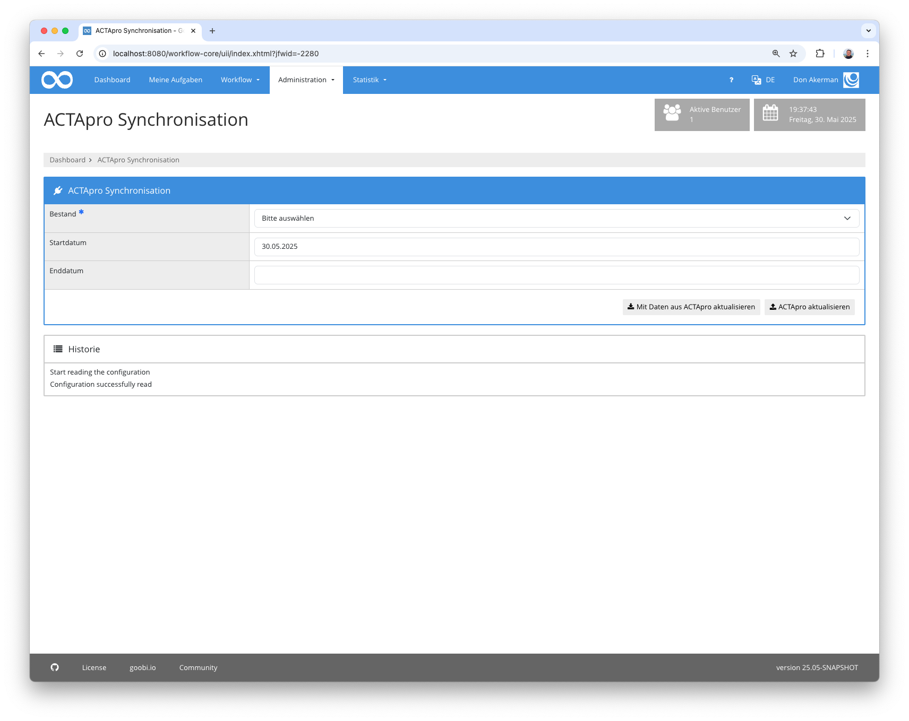

## Einführung
Die vorliegende Dokumentation beschreibt die Installation, die Konfiguration und den Einsatz des Administration Plugins für die Synchronisation von Archivbeständen aus Goobi workflow mit ACTApro. Dabei können Knoten aus ACTApro neu importiert werden oder bestehenden Knoten mit aktuellen Metadaten aus ACTApro aktualisiert werden. Die Gegenrichtung ist ebenso möglich. So können neue Knoten im Archiv-Management erstellt oder bestehende Knoten verändert werden und diese Informationen an ACTApro geschickt werden.


## Installation
Um das Plugin nutzen zu können, müssen folgende Dateien installiert werden:

```bash
/opt/digiverso/goobi/plugins/administration/plugin-administration-actapro-sync-base.jar
/opt/digiverso/goobi/plugins/GUI/plugin-administration-actapro-sync-gui.jar
/opt/digiverso/goobi/plugins/GUI/plugin-administration-actapro-sync-lib.jar
/opt/digiverso/goobi/config/plugin_intranda_administration_actapro_sync.xml
```

Für eine Nutzung dieses Plugins muss der Nutzer über die korrekte Rollenberechtigung verfügen.


Bitte weisen Sie daher der Gruppe die Rolle `Plugin_administration_actapro_sync` zu.


## Überblick und Funktionsweise
Wenn das Plugin korrekt installiert und konfiguriert wurde, ist es innerhalb des Menüpunkts `Administration` zu finden.



Hier kann als erstes der zu aktualisierende Bestand ausgewählt werden. Außerdem kann optional ein Start- und Enddatum angegeben werden. Wenn ein Start- oder Enddatum existiert, wird beim Import aus ACTApro nur nach Knoten gesucht, die innerhalb des angegebenen Zeitraum erstellt oder geändert wurden. Ansonsten wird nach allen Knoten des Bestands gesucht.

Anschließend können durch Klick auf den Button die lokalen Daten mit Daten aus ACTApro angereichert werden oder lokale Änderungen an ACTApro gemeldet werden.

Damit die Synchronisation funktioniert, müssen folgende Punkte erfüllt sein:

- in ACTApro muss der root-Knoten des Bestands existieren
- Der Bestand muss im Archiv-Management erstellt worden sein
- Der root-Knoten des Bestands muss im Archiv-Management existieren
- im root-Knoten muss die ID des ACTApro-root-Dokuments eingetragen werden 

Wenn `Mit Daten aus ACTApro aktualisieren` ausgewählt wurde, wird zuerst in ACTApro nach allen Datensätzen gesucht, die zu diesem Bestand gehören (gegebenenfalls eingeschränkt auf ein Änderungsdatum innerhalb des gesetzten Zeitraums). Für jeden gefundenen Datensatz wird das vollständige Metadaten-Dokument abgefragt und dann anhand der ACTApro-ID geprüft, ob im Archiv-Mangement bereits ein Knoten existiert oder ob es sich um einen neuen Knoten handelt. Wenn der Knoten bereits existiert, wird als nächstes geprüft, ob der Knoten immer noch das gleiche Elternelement hat oder inzwischen an einen anderen Ort umgehängt wurde. Anschließend werden die konfigurierten Felder gelesen und deren Inhalte in die Knoten überführt.
Wenn es sich um einen neuen Knoten handelt, wird die in `path` angegebene Hierarchie geprüft und nach den Elternknoten gesucht. Gegebenfalls müssen diese ebenfalls neu erstellt werden. Wurde der Elternknoten gefunden (oder neu erstellt), wird an der agegebenen Reihenfolge (`$.Ref_Gp.Ref_DocOrder`) ein neuer Knoten erstellt, die ID importiert und anschließend die Metadaten importiert.

Bei `ACTApro aktualisieren` werden Daten aus dem Archiv-Management nach ACTApro geliefert. Hierzu wird bei jedem Knoten aus dem ausgewählten Bestand geprüft, ob er bereits eine ACTApro-ID enthält. Wenn dies der Fall ist, wird das zugehörige ACTApro json Document abgefragt und mit den konfigurierten Feldern aus dem Knoten überschrieben. Falls sich die ID des Elternknoten geändert hat, werden die neuen Informationen in `$.Ref_DocKey`, `$.Ref_DocOrder` und `$.Ref_Doctype` geschrieben. Das Dokument wird anschließend in ACTApro aktualisiert.
Falls noch keine ACTApro-ID existiert, handelt es sich um einen neuen Knoten, der in ACTApro bisher unbekannt ist. Dann wird ein neues json-Document erstellt, die Metadaten und das Elternelement angegeben und in ACTApro neu erstellt. Die dabei generierte ID wird anschließend im Knoten gespeichert, so dass beim nächsten Durchlauf eine Aktualisierung möglich ist. 

Das Löschen von Knoten kann nicht synchronisiert werden, da beide Systeme keine Informationen über gelöschte Elemente vorhalten. Knoten müssen daher von Hand gelöscht werden.

## Konfiguration
Die Konfiguration des Plugins erfolgt in der Datei `plugin_intranda_administration_actapro_sync.xml` wie hier aufgezeigt:

{{CONFIG_CONTENT}}

Die folgende Tabelle enthält eine Zusammenstellung der Parameter und ihrer Beschreibungen:

Parameter               | Erläuterung
------------------------|------------------------------------
`authentication`        | Hier werden die Angaben zur Authentifierung zusammengefasst
`authServiceUrl`        | Enthält die URL zum Authentifierungsservice von ACTApro
`authServiceHeader`     | Enthält den Authorization header Parameter
`authServiceUsername`   | Nutzername
`authServicePassword`   | Passwort
`connectorUrl`          | Die URL zur ACTApro REST-API 
`eadIdField`            | Name des Metadatums, in dem die ID des Knotens aus ACTApro gespeichert wird. Darüber findet das Matching zwischen Archiv-Management Knoten und ACTApro Dokument statt
`inventory`             | Definition eines Bestandes, der in der Oberfläche ausgewählt werden kann.
`@archiveName`          | Name des Bestandes im Archiv-Management
`@actaproId`            | ID des root Knoten in ACTApro 
`metadata`              | Hier wird das Mapping zwischen den einzelnen Feldern im Archiv-Management und ACTApro Dokument definiert
`field`                 | Enthält das Mapping zu einem einzelnen Feld
`@type`                 | Enthält den Namen des `type` Feldes innerhalb der `fields` list im ACTApro json Dokument
`@groupType`            | Falls das gesuchte Feld ein Unterfeld eines anderen `type` Feldes ist, kann das übergeordnete Feld hier angegeben werden.
`@eadField`             | Name des Feldes im Archiv-Management
`@eadGroup`             | Falls das Feld in einer Gruppe ist, kann der Gruppenname hier angegeben werden
`@eadArea`              | Der Bereich, indem das Feld zu finden ist: `1` (Identity Statement Area), `2` (Context Area), `3` (Content and Structure Area), `4` (Condition of Access and Use Area), `5` (Allied Materials Area), `6` (Note Area), `7` (Description Control Area)
`nodeTypes`             | Hier wird das Mapping zwischen den Knotentypen in ACTApro und dem Archiv-Management konfiguriert
`type`                  | Enthält das Mapping für einen einzelnen Knotentyp
`@actaPro`              | Name des `type` Feldes im ACTApro json-Dokument
`@node`                 | Name des Knotentyps im Archiv-Management
