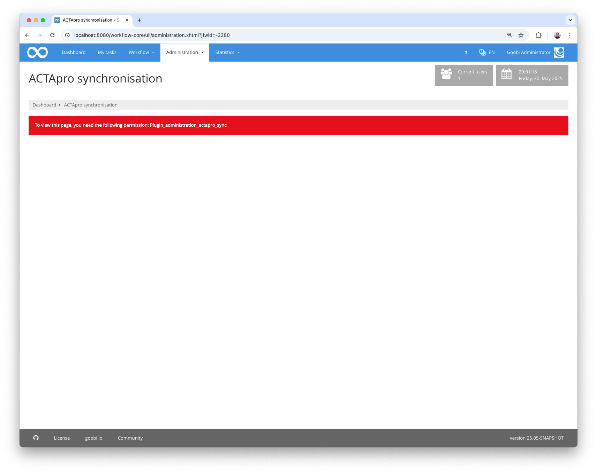
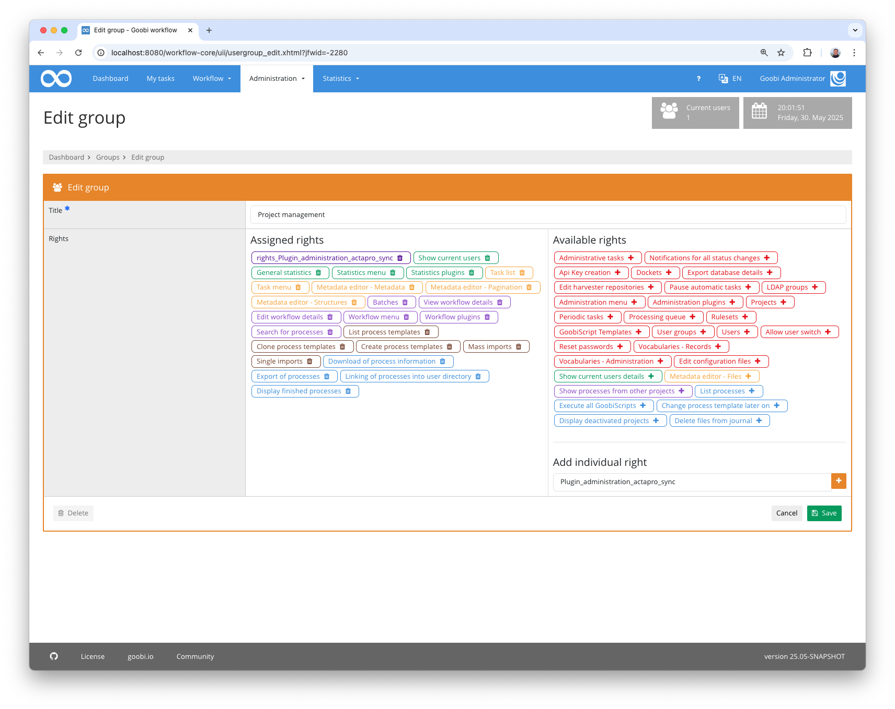

## Introduction
This documentation describes the installation, configuration and use of the Administration Plugin for synchronising archive files between Goobi workflow and ACTApro. Nodes can be newly imported from ACTApro or existing nodes can be updated with current metadata from ACTApro. The opposite direction is also possible. New nodes can be created in Archive Management or existing nodes can be modified and this information sent to ACTApro.


## Installation
In order to use the plugin, the following files must be installed:

```bash
/opt/digiverso/goobi/plugins/administration/plugin-administration-actapro-sync-base.jar
/opt/digiverso/goobi/plugins/GUI/plugin-administration-actapro-sync-gui.jar
/opt/digiverso/goobi/plugins/GUI/plugin-administration-actapro-sync-lib.jar
/opt/digiverso/goobi/config/plugin_intranda_administration_actapro_sync.xml
```

To use this plugin, the user must have the correct role authorisation.



Therefore, please assign the role `Plugin_administration_actapro_sync` to the group.




## Overview and functionality
If the plugin has been installed and configured correctly, it can be found under the `Administration` menu item.


The stock to be updated can be selected here first. A start and end date can also be optionally specified. If a start or end date exists, the import from ACTApro only searches for nodes that were created or changed within the specified period. Otherwise, the system searches for all nodes in the database.

The local data can then be enriched with data from ACTApro or local changes can be reported to ACTApro.

The following points must be fulfilled for synchronisation to work:

* the root node of the inventory must exist in ACTApro
* The inventory must have been created in Archive Management
* The root node of the inventory must exist in Archive Management
* The ID of the ACTApro root document must exist in the Archive Management root node 

If ‘Update with data from ACTApro’ is selected, ACTApro is first searched for all records that belong to this inventory (possibly restricted to a modification date within the selected time period). For each  record found, the complete metadata document is queried and then the ACTApro ID is used to check whether a node already exists in Archive Management or whether it is a new node. If the node already exists, the next step is to check whether the node still has the same parent element or has been moved to a different location in the meantime. The configured fields are then read and their contents transferred to the nodes.
If it is a new node, the hierarchy specified in `path` is checked and the parent nodes are searched for. If necessary, these must also be created. If the parent node is found (or newly created), a new node is created at the specified order ($.Ref_Gp.Ref_DocOrder), the ID is imported and then the metadata is imported.

With ‘Update ACTApro’, data from Archive Management is delivered to ACTApro. For this purpose, a check is carried out for each node from the selected inventory to determine whether it already contains an ACTApro ID. If this is the case, the associated ACTApro json document is queried and overwritten with the configured fields from the node. If the ID of the parent node has changed, the new information is written to $.Ref_DocKey, $.Ref_DocOrder and $.Ref_Doctype. The document is then updated in ACTApro.
If no ACTApro ID exists yet, this is a new node that is not yet known in ACTApro. A new json document is then created, the metadata and the parent element specified and then submitted to ACTApro. The ID generated by ACTApro is then saved in the node so that it can be updated the next time it is run. 

The deletion of nodes cannot be synchronised as neither system holds any information about deleted elements. Nodes must therefore be deleted manually.
z

## Configuration
The plugin is configured in the file `plugin_intranda_administration_actapro_sync.xml` as shown here:

{{CONFIG_CONTENT}}

The following table contains a summary of the parameters and their descriptions:

Parameter               | Explanation
------------------------|------------------------------------
`authentication` | The authentication details are summarised here
`authServiceUrl` | Contains the URL to the authentication service of ACTApro
`authServiceHeader` | Contains the Authorization header parameter
`authServiceUsername` | user name
`authServicePassword` | password
`connectorUrl` | The URL to the ACTApro REST API 
`eadIdField` | Name of the metadata in which the ID of the node from ACTApro is stored. This is used for matching between the archive management node and the ACTApro document
`inventory` | Definition of an inventory that can be selected in the interface.
`@archiveName` | Name of the inventory in Archive Management
`@actaproId` | ID of the root node in ACTApro 
`metadata` | The mapping between the individual fields in Archive Management and ACTApro document is defined here
`field` | Contains the mapping to a single field
`@type` | Contains the name of the `type` field within the `fields` list in the ACTApro json document
`@groupType` | If the field you are looking for is a subfield of another `type` field, the parent field can be specified here.
`@eadField` | Name of the field in Archive Management
`@eadGroup` | If the field is in a group, the group name can be specified here
`@eadArea` | The area in which the field can be found: 1 (Identity Statement Area), 2 (Context Area), 3 (Content and Structure Area), 4 (Condition of Access and Use Area), 5 (Allied Materials Area), 6 (Note Area), 7 (Description Control Area)
`nodeTypes`  | The mapping between the node types in ACTApro and Archive Management is configured here
`type` | Contains the mapping for a single node type
`@actaPro` | Content of the `type` field in the ACTApro json document
`@node` | Name of the node type in Archive Management
